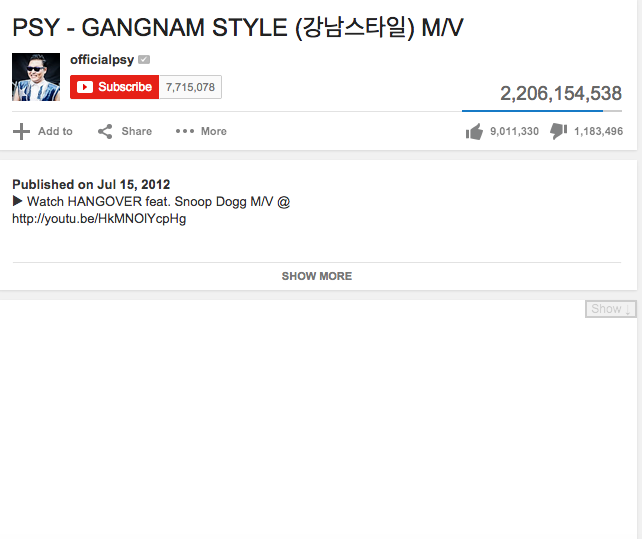

# Don't Read The Comments!
Don't Read The Comments! is a browser extension which hides comment sections.

<figure>
    
    <figcaption>DRTC! in action</figcaption>
</figure>

DRTC! works by simply placing an opaque cover over the comments section of the page you're viewing. The comments are still there; if you want to see them you can click the **Show** control in the top right.

DRTC! works with [Chrome](https://chrome.google.com/webstore/detail/dont-read-the-comments/nlhmhpppjnlbdfgebinkgjiljipnejbe) and [Firefox](https://addons.mozilla.org/en-US/firefox/addon/dont-read-the-comments/).

## Don't Read the Comments! Philosophy

DRTC! is not about censorship. Censorship is a load of bollocks.

Individuals have a right to control for themselves what information they consume, as well as what they choose not to consume. Don't Read The Comments! came out of an offhand remark I once made about how I often unconsciously scroll down to read comments, even though I know I'll regret it. DRTC! is intended to put an additional layer of decision between the habitual scroller and the waste of time and attention that awaits.

